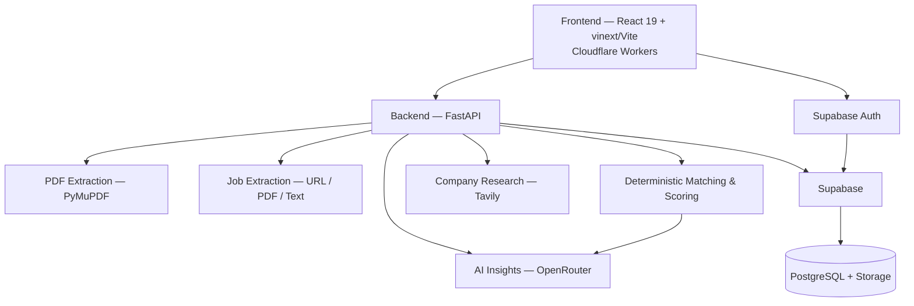

# IntelliApply

> AI-powered career intelligence for smarter job applications.

IntelliApply is a full-stack career workspace that brings the whole job application journey into one place. Instead of juggling a resume checker, a job description parser, a company research tab, a spreadsheet tracker and an interview prep doc, you do all of it in one app.

Upload a resume, add a job, and IntelliApply parses both, scores the match deterministically, explains the result with an LLM, shows you the skill gaps, tells you what to fix, and then keeps the resume, job description, analysis, cover letter and interview prep together as one application you can track.

**One platform. The entire application journey.**

- Live demo: https://intelliapply.intelliapply.workers.dev (Cloudflare Worker configured in `frontend/wrangler.jsonc`)
- API: https://cutc-intelliapply.onrender.com 
- GitHub: https://github.com/Tanmaysavaj/cutc-IntelliApply
- Documentation: this README

---

## Why IntelliApply?

Applying for internships, co-ops and jobs can feel like a full-time job. For a single application you end up reading the job description, comparing it to your resume, working out which skills match, working out which ones are missing, researching the company, tailoring the application, logging it somewhere, and then preparing for the interview.

Those steps are usually spread across five different tools.

> Why do I need five different tools just to apply for one job?

That question became IntelliApply.

---

## What IntelliApply Does

### Resume Intelligence
Upload a PDF resume. Text is extracted with PyMuPDF and turned into structured data by an LLM: hard skills, soft skills, work experience, education, certifications, projects and keywords.

### Job Intelligence
Add a job three ways — paste a URL, paste the description, or upload a job PDF. IntelliApply extracts the title, company, responsibilities, required skills and preferred skills.

Job input is validated before it's trusted. If a URL only yields a job-board shell page, extraction is rejected rather than guessed at (generic company names like `linkedin`, `indeed`, `greenhouse` and `workday` are caught, along with empty responsibilities and too-short page text). LinkedIn `currentJobId` search URLs are normalized to their canonical job view URL.

### Resume-to-Job Matching
A deterministic scoring engine compares the parsed resume against the parsed job and produces a 0–100 match score with a per-component breakdown.

| Component | Weight |
|---|---|
| Required skills | 45% |
| Preferred skills | 15% |
| Experience | 15% |
| Responsibilities | 15% |
| Education | 10% |

Skills are normalized before comparison using an alias table (`k8s` → `kubernetes`, `js` → `javascript`, and so on) so that wording differences don't cost you points. The same inputs always produce the same score.

### AI Career Insights
The deterministic result is handed to an LLM, which explains it: why you match, what your strengths are, what the score means, and an overall recommendation (`apply`, `consider`, `low_match`). The model is explicitly told the deterministic score is authoritative and must not be recalculated, so the number stays stable and only the reasoning is generated.

Insights are validated after generation, and if the model is unavailable the analysis still returns with insights marked `unavailable` instead of failing.

### Skill Gap Analysis
Two layers. The scoring engine lists exactly which required and preferred skills are missing. The LLM then adds context per gap: how important it is, why it matters for this role, and what to do about it.

### Application Guidance
Concrete resume improvement suggestions and interview preparation generated from the analysis, not generic advice.

### Application Tracking
Applications move through: `SAVED` → `APPLIED` → `SCREENING` → `INTERVIEW` → `OFFER` → `REJECTED` → `WITHDRAWN`. Notes and interview dates can be attached, and `applied_date` is set automatically on the move to `APPLIED`.


### Application Analytics
Totals, average match score, strong/moderate/low score distribution, and the skill gaps that keep showing up across your applications. Computed on the frontend from your local analysis history.

### Resume Re-analysis
Re-run the same job against an updated resume and see a side-by-side comparison: old score, new score, the point difference, what improved, and what's still missing.

### Interview Preparation
Technical questions, behavioural questions and topics to review, tied to the specific application.

### Career Snapshot
A summary of your application patterns, strengths and recurring gaps. Currently available in Demo Mode.

### Company Research
Backend endpoint that researches a company via Tavily and caches the result in Supabase for 7 days. Available at `GET /api/company/{company_name}`; not yet wired into the frontend UI.

---

## How It Works

1. **Upload Resume** — PDF in, structured profile out
2. **Add a Job** — URL, pasted description, or PDF
3. **Analyze Match** — deterministic score plus breakdown
4. **Understand Skill Gaps** — what's missing and why it matters
5. **Improve Application** — targeted resume and application recommendations
6. **Save Application** — keep the whole package together
7. **Prepare for Interview** — questions and topics from your actual analysis
8. **Track Progress** — status, notes, interview date

The point is step 4 onward. Most tools stop at the score.

---

## Application Package

Once you save an application, IntelliApply keeps the materials together instead of scattering them:

- Resume used for that application
- Job description
- Cover letter
- Match analysis and score breakdown
- Skill gaps
- AI recommendations
- Interview preparation
- Application status and timeline
- Notes

> Everything you need for every application, in one place.

---

## AI & Matching Approach

IntelliApply does not dump a resume and a job description into an LLM and trust whatever comes back. The score is computed in code; the LLM explains it.

```
Structured document parsing (PyMuPDF)
        ↓
Structured resume / job data (Pydantic models)
        ↓
Deterministic matching & scoring (weighted, alias-normalized)
        ↓
LLM-powered reasoning and insights (validated)
        ↓
Actionable recommendations
```

Deterministic logic handles anything where consistency matters — scoring, skill matching, experience and education comparison. The LLM handles extraction into a schema, and the reasoning, explanation and personalization on top of the score.

Everything the LLM returns is parsed into a Pydantic model via structured outputs, so responses are typed rather than free text. Extraction prompts explicitly instruct the model to use only information stated in the document and to leave missing fields null.

**Models:** all LLM calls go through [OpenRouter](https://openrouter.ai) using the OpenAI SDK. The configured default is `google/gemini-2.5-flash`, overridable with the `OPENROUTER_MODEL` environment variable.

---

## Architecture



---

## Tech Stack

**Frontend**
- React 19
- vinext (Next-compatible app router on Vite)
- Vite 8 with `@vitejs/plugin-rsc` and `@vitejs/plugin-react`
- Tailwind CSS v4
- TypeScript
- `@supabase/supabase-js`

**Backend**
- Python 3.11
- FastAPI
- Uvicorn
- Pydantic v2

**Database & Auth**
- Supabase (PostgreSQL, Storage, Auth)
- Supabase email/password auth with JWT bearer tokens
- PyJWT for backend token verification
- PostgreSQL Row Level Security

**AI**
- OpenRouter (via the OpenAI Python SDK)
- `google/gemini-2.5-flash` (default, configurable)
- Pydantic structured outputs

**Document Processing**
- PyMuPDF
- Python stdlib `html.parser` for URL scraping

**Search / Research**
- Tavily
- `python-whois`

**Deployment**
- Cloudflare Workers (frontend, via `@vinext/cloudflare` + Wrangler)
- GitHub Actions

**Development**
- Git / GitHub
- pytest
- ESLint
- npm

---

## Project Structure

```
cutc-IntelliApply/
├── backend/                  # FastAPI application
│   ├── app/
│   │   ├── main.py           # App entrypoint, CORS, router registration
│   │   ├── config.py         # Environment configuration
│   │   ├── api/              # resume, jobs, analysis, company, applications
│   │   ├── core/             # auth.py (JWT), supabase.py (client)
│   │   ├── db/
│   │   │   ├── schema.sql    # Tables, RLS policies
│   │   │   └── migrations/   # 001_user_trigger, 002_rls_and_indexes
│   │   ├── schemas/          # API request/response models
│   │   └── services/         # pdf, llm, matching, ai_insights, tavily, whois, url, job
│   ├── tests/                # pytest suite
│   ├── requirements.txt
│   └── .env.example
├── frontend/                 # React 19 + vinext app
│   ├── app/                  # layout.tsx, page.tsx, globals.css
│   ├── lib/
│   │   ├── api.ts            # Authenticated backend client
│   │   ├── auth.ts, useAuth.ts, supabase.ts
│   │   ├── useDemo.ts        # Demo Mode
│   │   ├── storage.ts, config.ts
│   │   └── data/             # Demo Mode seed data
│   ├── tests/
│   ├── wrangler.jsonc        # Cloudflare Worker config
│   ├── vite.config.ts
│   ├── package.json
│   └── .env.example
├── src/                      # Shared core library (also the legacy CLI)
│   ├── models/               # Pydantic models: resume, job, analyses, reports
│   ├── services/             # llm, pdf, tavily, whois
│   ├── phase1/, phase2/, phase3/
│   ├── config.py
│   └── main.py               # Typer CLI
├── .github/workflows/
│   └── deploy-frontend.yml
├── .env.example
└── README.md
```

`src/` is not dead code — the FastAPI backend imports its Pydantic models and its LLM, PDF, Tavily and WHOIS services. Keep it in place.

---

## Getting Started

### Prerequisites

- Python 3.11 (see `.python-version`)
- Node.js 22 (matches CI)
- An OpenRouter API key
- A Tavily API key (only needed for company research)
- A Supabase project (only needed for auth and persistence)

You can run and demo the app without Supabase — see [Demo Mode](#demo-mode).

### 1. Clone

```bash
git clone https://github.com/Tanmaysavaj/cutc-IntelliApply.git
cd cutc-IntelliApply
```

### 2. Configure environment variables

The backend loads a single `.env` from the **repository root**.

```bash
cp .env.example .env
cp frontend/.env.example frontend/.env
```

Fill in your keys. See [Environment Variables](#environment-variables).

### 3. Backend

Run from the `backend/` directory:

```bash
cd backend
python -m venv venv
source venv/bin/activate        # Windows: venv\Scripts\activate
pip install -r requirements.txt
pip install requests pytest     # imported by the app / tests, not yet pinned in requirements.txt
uvicorn app.main:app --reload --host 0.0.0.0 --port 8000
```

API: `http://localhost:8000`
Swagger: `http://localhost:8000/api/docs`
ReDoc: `http://localhost:8000/api/redoc`
Health: `http://localhost:8000/api/health`

### 4. Frontend

Run from the `frontend/` directory, in a second terminal:

```bash
cd frontend
npm install
npm run dev
```

The dev server URL is printed in the terminal. Backend CORS is preconfigured for `localhost:3000` and `localhost:5173`; if your dev server picks a different port, add it to the origin list in `backend/app/main.py`.

### Frontend scripts

| Command | Description |
|---|---|
| `npm run dev` | Start the dev server |
| `npm run build` | Production build |
| `npm run start` | Serve the production build |
| `npm run deploy` | Deploy to Cloudflare Workers |

---

## Environment Variables

**Repository root `.env`** — read by the backend and by `src/`:

```env
OPENROUTER_API_KEY=
OPENROUTER_MODEL=google/gemini-2.5-flash
TAVILY_API_KEY=
SUPABASE_URL=
SUPABASE_SERVICE_ROLE_KEY=
SUPABASE_JWT_SECRET=
```

**`frontend/.env`**:

```env
NEXT_PUBLIC_API_URL=http://localhost:8000
NEXT_PUBLIC_SUPABASE_URL=
NEXT_PUBLIC_SUPABASE_ANON_KEY=
```

`backend/.env.example` additionally documents `HOST`, `PORT` and `DEBUG`.

Notes:

- `SUPABASE_SERVICE_ROLE_KEY` is backend-only. Never expose it to the frontend.
- The frontend must only ever use the anon/publishable key.
- If `SUPABASE_JWT_SECRET` is not set, the backend falls back to verifying tokens through the Supabase API.
- `.env` files must never be committed. They are gitignored — keep it that way.

---

## Supabase

Supabase provides authentication, PostgreSQL persistence and resume file storage.

**Auth:** email/password sign-up and sign-in from the frontend. The frontend attaches the access token as a `Bearer` header on every backend request; the backend verifies it (HS256) and resolves the user ID. Most endpoints accept unauthenticated requests and simply skip persistence, which is what lets the app be used without an account.

**Tables** (`backend/app/db/schema.sql`):

| Table | Purpose |
|---|---|
| `users` | Mirrors `auth.users`, populated by a trigger on sign-up |
| `resumes` | Storage file URL plus parsed resume JSON |
| `jobs` | Job URL, company, title, description, parsed job JSON |
| `analyses` | Match score and full analysis result, linked to a resume and job |
| `company_research` | Cached Tavily company research, unique on lowercased company name |

**Storage:** a `resumes` bucket, with uploads written to `{user_id}/{resume_id}.pdf`.

**Setup:** run `app/db/schema.sql`, then `app/db/migrations/001_user_trigger.sql` and `002_rls_and_indexes.sql` in the Supabase SQL editor.

Row Level Security is enabled on `resumes`, `jobs` and `analyses` with `auth.uid() = user_id` policies. Because the backend connects with the service role key, RLS is bypassed on that path and user scoping is enforced in the API layer by filtering every query on `user_id`.

---

## Demo Mode

Demo Mode gives you the fully populated product without configuring Supabase, OpenRouter or Tavily. Enter it straight from the landing page.

It's the fastest way to see what IntelliApply actually is, and it's what you should use to evaluate the project.

What you can explore in Demo Mode:

- A parsed resume with skills, experience, education and projects
- Recommended jobs to analyze
- A full match analysis: score, breakdown, why you match, skill gaps, resume improvements
- Career Snapshot
- Analysis history
- Applications, with status filters and the full Application Package view (cover letter, job description, match analysis, interview prep, timeline, notes)
- Analytics, including status breakdown and interview rate
- Resume re-analysis with a before/after score comparison

Demo data lives in `frontend/lib/data/` and is toggled by `frontend/lib/useDemo.ts`. A `DEMO MODE` badge stays visible while active, and "Exit Demo" returns you to the live app.

---

## Deployment

**Frontend — Cloudflare Workers.** `.github/workflows/deploy-frontend.yml` deploys on every push to `main` that touches `frontend/**`, and can also be run manually. It installs with `npm ci` on Node 22 and deploys with:

```bash
npx @vinext/cloudflare deploy
```

Required repository secrets: `CLOUDFLARE_API_TOKEN`, `CLOUDFLARE_ACCOUNT_ID`.

Worker config is in `frontend/wrangler.jsonc` (`name: intelliapply`, `nodejs_compat`, static assets served from `dist/client`). This deploys as a **Worker**, not Cloudflare Pages.

To deploy manually:

```bash
cd frontend
npm run deploy
```

**Backend — not yet configured.** There is no Dockerfile, Procfile, service manifest or backend CI in this repository. Deploying it is TODO. Once hosted, set `NEXT_PUBLIC_API_URL` on the frontend and add the frontend origin to the CORS list in `backend/app/main.py`.

---

## Testing & Evaluation

**Backend — pytest:**

```bash
cd backend
pytest tests/ -v
```

| File | Covers |
|---|---|
| `test_matching.py` | Skill normalization and aliasing, skill/experience/education/responsibility matching, weighting, edge cases, and score determinism (same input → same score) |
| `test_jobs.py` | LinkedIn URL normalization, job extraction validation, regression prevention |
| `test_ai_insights.py` | AI insights service with a mocked LLM |
| `test_resume.py` | File validation, health and root endpoints |

One test class in `test_matching.py` (`TestAnalysisEndpointWithAIInsights`) is currently skipped pending a mock refactor. No coverage percentage is claimed.

**Frontend:** test files exist under `frontend/tests/` (job processing, integration verification, rendered HTML) but no test runner is wired into `package.json` yet, so they can't be run with `npm test` as-is.

**Evaluation approach:** correctness of extraction and scoring was checked by hand against real resumes and real job postings, focusing on extraction accuracy, score plausibility, job-board shell detection, and failure behaviour when a URL or the LLM doesn't cooperate. That last one is why extraction validation and the safe-insights fallback exist.

---

## Security Notes

- All API keys are read from environment variables. None are hardcoded.
- `.env` files are gitignored and must never be committed.
- Authentication uses Supabase Auth; the backend verifies JWTs before returning any user data.
- Row Level Security policies are defined on `resumes`, `jobs` and `analyses`. The backend uses the service role key, so it bypasses RLS and enforces per-user scoping in the API layer by filtering on `user_id`.
- The service role key is backend-only; the frontend uses the anon key.
- Uploaded resumes are written to a temp file, processed, and deleted in a `finally` block.
- Unhandled backend errors return a generic message rather than leaking internals.

Known gap: the placeholder values committed in the root `.env.example` should be replaced with descriptive placeholders.

---

## User Validation

[Add verified user validation statistic here]

---

## Challenges

- **Getting reliable structure out of unstructured documents.** Resumes and job postings have no common format. Strict extraction prompts plus Pydantic structured outputs got us usable data.
- **Job URLs that don't contain the job.** Scraping a job board often returns a shell page. We had to detect that and fail loudly rather than let the LLM invent a job posting, which is where the extraction validation layer came from.
- **Making the score trustworthy.** An LLM asked to score a resume gives a different answer each time. Moving scoring into deterministic code and restricting the LLM to explanation fixed it, but it meant carefully instructing the model not to recalculate.
- **Skill matching across wording differences.** `k8s` and `Kubernetes` are the same skill. Normalization and an alias table were necessary before any comparison was meaningful.
- **Fitting AI into a real workflow.** The analysis is easy to build in isolation; making it flow into skill gaps, then recommendations, then a saved application and interview prep took most of the design effort.
- **Keeping it cheap and light.** Compact prompt inputs, caching company research for 7 days, and a fast model keep costs low.

---

## What We Learned

- AI is most useful sitting on top of structured data, not replacing it.
- A match score with no explanation isn't worth much.
- Candidates want to know what to do next, not just how they scored.
- UX matters as much as model quality. Good output presented badly still feels useless.
- The end-to-end workflow creates more value than any single AI feature in it.
- Deciding what the LLM should *not* do was as important as deciding what it should.

---

## What's Next

All future work, not yet implemented:

- Persist applications to Supabase and build out the live applications UI
- Deploy the backend and wire up a hosted API
- Bring company research and WHOIS legitimacy checking into the frontend
- Live Career Snapshot backed by real user data
- Calendar and interview reminders
- Email integration for application updates
- Richer analytics computed server-side
- More resume comparison and versioning tools
- Per-task model selection and further prompt/cost optimization
- Wire up a frontend test runner

---

## Team

| Member | Role | Focus |
|---|---|---|
| **Tanmay Savaj** | Backend & AI Engineer — Lead | Backend architecture, AI integration, analysis pipeline, system integration |
| **Yashasvini** | UI/UX Designer | User experience, interface design, visual system |
| **Samia** | Integration / QA / Product | System integration, testing, product validation |
| **Yeldana** | Frontend Engineer | Frontend implementation, components, application interface |

Links are listed in `frontend/lib/config.ts`.

---

## Legacy CLI / Development Tools

Before the web app, IntelliApply was a CLI. That code still lives in `src/` and is still a dependency of the backend, which imports its Pydantic models and its LLM, PDF, Tavily and WHOIS services.

The Typer CLI itself (`src/main.py`, with `market`, `resume` and `advisor` commands) reads PDFs from `input/` directories and writes reports to `data/` and `reports/`. Those directories are gitignored and not present in the repo, and `typer` and `jinja2` are not listed in `backend/requirements.txt`, so the CLI needs its inputs and dependencies set up manually before it will run. It is kept for reference and for the shared services — the web app is the product.

---

## CUTC Hackathon 2026

Built for the CUTC Hackathon 2026.

---

## License

License information will be added. No LICENSE file is currently present in this repository.
